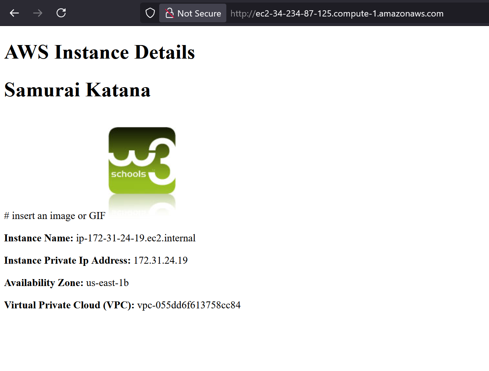

#readme for EC2 setup and teardown

1. Create Security Group and modify inbound rules to allow SSH / port 22 / anywhere IPv4 
& allow HTTP / port 80 / anywhere IPv4

2. Go to Instances -> launch instances

3. Scroll down until you see 'key pair (login)' -> Create new key pair
4. Scroll down to 'network settings' -> Select existing security group -> the one you made in step 1

5. Scroll down to 'advanced details -> scroll all the way down to 'User data' -> add script from Github
provided in class (https://github.com/balericaclass7/bmc5/blob/main/ec2scrpit)

6. Click 'launch instance'

7. Once loaded, go to 'Instance summary' and look for Public DNS -> copy link and open in new tab to verify your server is running

  

Teardown instructions:
A. In 'Instances' - go to Instance state -> Terminate (delete) instance
B. Click 'Terminate (delete)' to confirm# Homework-Sept2025

--------------------------------------------\\\

HW - DELIVERABLES (5 pts)

Screenshot of running web server
Copy of the start up script saved as a .txt file
Readme instructions on how to configure the EC2 with teardown instructions
