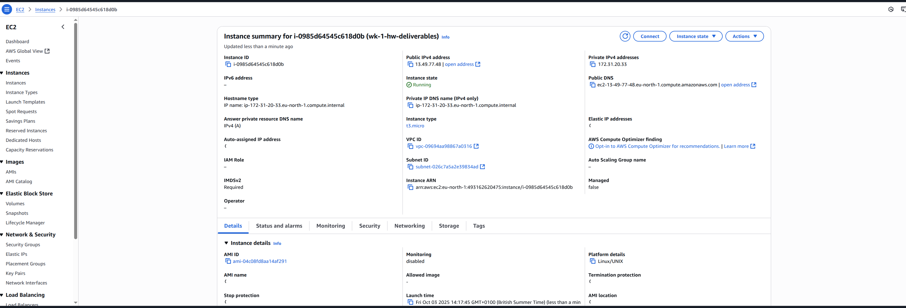

# Week 1 Homework Deliverables

EC2 Basics
TheoWAF's EC2 Script --> https://github.com/BashiM1/bmc5/blob/main/ec2scrpit

# Images (screenshots)

Samurai Katana screenshot

AWS console - My Instance Summary

# Complete EC2 Setup & Teardown:

This is a foolproof guide to getting a basic web server running on AWS and then tearing it down so you don't get a surprise bill.

Do the setup steps in order. Do the teardown steps in order. Don't get fancy.

---

## EC2 SETUP

Alright. We're doing this in two parts. First, the firewall. Then, the server. Do it in this order or you'll be clicking around wondering why stuff is broken.

### Part 1: The Security Group (Your Bouncer)

This is the firewall. Its only job is to block or allow traffic. We need to build this first so we can assign it to our server when we make it.

1.  From the EC2 Dashboard, look at the menu on the left. Find **Security Groups** under **Network & Security**. Click it.
2.  Hit the big orange **Create security group** button.

**Fill this form out. Don't overthink it.**

*   **Security group name:** Call it whatever you want. `My-Web-Server-SG` is good. This name is for YOU.
*   **Description:** Seriously, just copy and paste the name in here. Future you will appreciate it.
*   **Inbound rules:** This is the important part. This is who you're letting in.
    *   Click **Add rule**.
    *   **Type:** Set this to **HTTP**.
    *   **Source:** Set this to **Anywhere-IPv4**. It will fill in with `0.0.0.0/0`. This means "let anyone on the internet see the website."
*   **Outbound rules:** **WE GO AROUND OUTBOUND RULES. DO NOT TOUCH THIS. EVER. NO EXCUSES.** The default is correct. It lets your server get software updates. If you touch this, you will break things.
*   **Tags:** Ignore for now. They're for organizing big projects.

Finally, click the orange **Create security group** button at the bottom. You'll see a green popup banner if it worked. Good. Firewall's done.

### Part 2: The EC2 Instance (The Actual Server)

Now we build the server and tell it to use the firewall we just made.

1.  In the left menu, click **Instances**.
2.  Hit the big orange **Launch instances** button.

**Again, just fill out the form. Only touch what I tell you to.**

*   **Name:** Name the server whatever you want. `My-Web-Server` is fine. The name is for you; AWS only cares about the instance ID.
*   **AMI:** Don't worry about this. Amazon Linux is what you want. Leave it.
*   **Instance Type:** Leave this alone. The default will be something like `t2.micro` or `t3.micro`. **Both are part of the Free Tier.** Whichever one it shows, just accept it and move on. It's fine.
*   **Key pair (login):** **PAY ATTENTION. THIS IS CRITICAL.** This is the ONLY way you can securely connect to your server.
    *   Click **Create new key pair**.
    *   **Key pair name:** Give it a name that makes sense, like the name of your server.
    *   Make sure **.pem** is selected.
    *   Click **Create key pair**.
    *   **YOUR BROWSER WILL DOWNLOAD THE `.pem` FILE. THIS IS THE ONLY TIME YOU CAN EVER GET IT.** If you lose this file, you are permanently locked out of your server. Save it somewhere safe. I am not kidding.
*   **Network settings:**
    *   Find this box and click the **Edit** button on the right.
    *   Find the section for **Firewall (security groups)**.
    *   Click the bubble for **Select existing security group**.
    *   In the dropdown, find and select the security group you made in Part 1.
*   **Configure storage:** Leave it alone. 8GB is fine.
*   **Advanced details:** Scroll ALL the way down and expand this section.
    *   Keep scrolling until you see a big text box called **User data**.
    *   **Paste your entire custom EC2 script (as raw text)** right into this box. This script runs ONE time, when the server is first created.

**Final Check:** Look at the Summary box on the right. Does it say `t3.micro` or `t2.micro`? Does it list your security group? Good.

Pray to all that is good and holy. Click the orange **Launch instance** button.

### Part 3: The Result

1.  You'll see a green success page. Click the blue link that looks like `i-012345abcdef...` to go to your instance.
2.  Wait for the **Instance state** to change from "Pending" to a green **"Running"**. This can take a minute.
3.  Once it's running, click the **checkbox** next to your instance.
4.  In the details panel at the bottom, find the **Public IPv4 DNS**. It's a long web address.
5.  Click the little "copy" icon next to it.
6.  **PASTE THIS INTO A NOTEPAD/TEXT EDITOR FIRST.**
7.  Now, go to your browser's address bar. Type `http://` and then paste the address you copied.
8.  **Full send.**

If your script was right, you should be looking at your live website. Go post the receipts in chat.

---

## TROUBLESHOOTING

If things didn't work, check these two things first.
*   **Is Auto-assign Public IP enabled?** Go to your instance > Networking tab. It should be enabled. If not, you need to terminate and start over.
*   **Is your address `http://` and not `https://`?** Your basic setup doesn't have an SSL certificate, so you have to use `http://`.

---

## FULL TEARDOWN INSTRUCTIONS

Do these in order. Terminate the instance first, then clean up the leftovers.

### Step 1: Terminate the EC2 Instance

1.  Go to the **EC2 Dashboard** and click on **Instances**.
2.  Find the instance you want to destroy and click the **checkbox** next to it.
3.  At the top of the screen, click the **Instance state** dropdown button.
4.  Select **Terminate instance**.
5.  Confirm on the popup window. The status will change to "shutting-down" and then "terminated."

### Step 2: Release the Elastic IP (If You Used One)

1.  In the left menu, find **Elastic IPs** under **Network & Security**.
2.  Click the **checkbox** next to the IP address that was for your server. It should say "disassociated."
3.  Click the **Actions** button at the top right, then select **Release Elastic IP addresses**.
4.  Confirm on the popup.

### Step 3: Delete Extra EBS Volumes (If You Made Any)

**CRITICAL FOR COST:** The main OS volume is deleted automatically. If you attached any *extra* data drives, they were NOT.

1.  In the left menu, find **Volumes** under **Elastic Block Store**.
2.  Look for any volumes with the state **"available"**. These are detached and costing you money.
3.  Click the **checkbox** next to any volume you need to destroy.
4.  Click the **Actions** button, then select **Delete volume**.
5.  Confirm on the popup.

### Step 4: Delete the Security Group

This is just good housekeeping. It costs nothing but keeps your account clean.

1.  In the left menu, find **Security Groups** under **Network & Security**.
2.  Find the security group you made (e.g., `My-Web-Server-SG`). **DO NOT DELETE THE ONE NAMED "default".**
3.  Click the **checkbox** next to it.
4.  Click the **Actions** button, then select **Delete security groups**.
5.  Confirm on the popup.

You're done. No surprise bill.