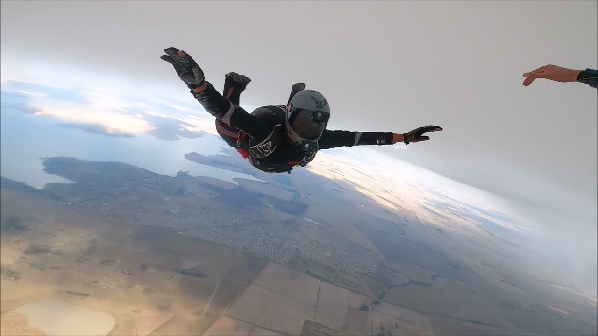

---

# Week 3 Homework Deliverables 🚀

---

## 👤 The Man Behind the Code

| Key       | Value       |
| :------------- | :---------- |
| **Name**       | Bash        |
| **Group Leader** | Brimah      |
| **Desired Compensation** | $450,000  |

---

## 🌟 My Personal Sanctuary: The Fortress of Solace

This is where clarity reigns. My Fortress of Solace—a tropical haven where complex visions take form, and the next big idea is born.

---

## 🎨 What Makes Me Tick (Beyond the Standard 9-to-5)

These are just some of the pursuits that help to define me

### 1. 💻 Cloud & Software Engineering: My Craft

Some people knit. I architect scalable and secure cloud platforms and build robust software. It's more than a skill; it's the language I speak fluently.

### 2. 📈 Taming the Wild West of Markets

Stocks, crypto, commodities. It's a high-stakes game of chess, and I'm always looking for the next move.
**My setup:**

### 3. 🎯 Marksmanship: Precision, Focus, Zen

It's not about the bang; it's about the bullseye. A quiet range, a steady hand. Pure meditation.
**My Indoor Range:**

### 4. 🥊 Muay Thai: My Kind of Therapy

Eight limbs, endless respect. My gym in Ko Pha Ngan isn't just a place; it's a crucible.

### 5. 🇮🇹 Italy: La Dolce Vita

Born there. The architecture hums history. The food? A love affair. That unique pull of a place etched into your earliest memories.

**The Duomo - Florence:** Ancient stones, timeless beauty.

### 6. 🏎️ The Need for Speed: My F12 Berlinetta

If it has an engine and goes ludicrously fast, I'm probably interested. My Berlinetta? Pure poetry in motion.

**My F12 Berlinetta:** A blur of speed, a symphony of power.

### 7. ✈️ Skydiving: Gravity's Optional

"Utrinque Paratus"—ready for anything. Especially plummeting from 10,000 feet. The world looks better upside down.

### 8. 🦈 Shark Diving: Eye-to-Eye with the Ancients

The deep blue calls. And sometimes, its oldest residents answer. A humbling, exhilarating encounter.

---

**Back to Submissions Log:**
[Submissions Log](../README.md)

<a href="#top">[▲ Back to Top]</a>

