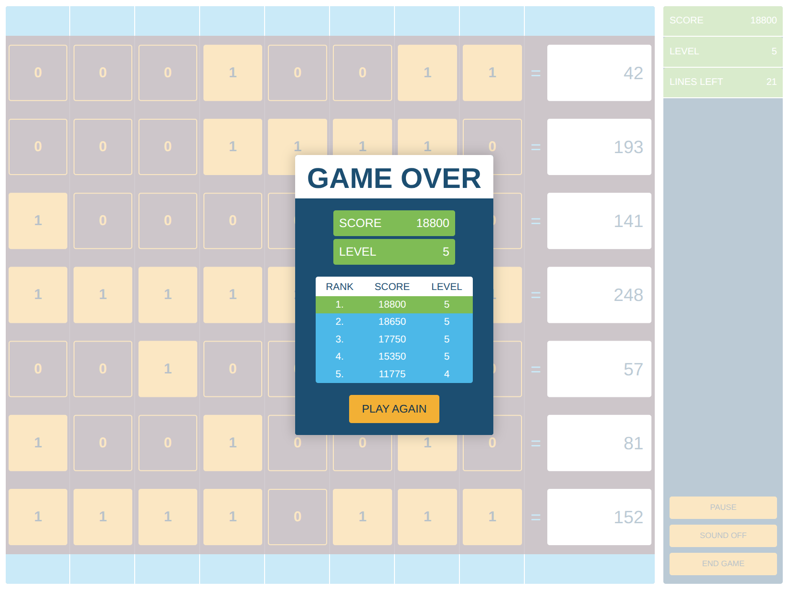

# 🌍 Network Architecture: Stockholm (EU-NORTH-1)

This table details the network architecture deployed within the Stockholm (EU-NORTH-1) AWS region.

## 🚀 Overview

The architecture is designed for high availability and robust segmentation, featuring a single Virtual Private Cloud (VPC) with a clearly defined IP scheme. It includes a resilient layout of public and private subnets distributed across three Availability Zones (AZs).

## 📊 Network Layout

The VPC utilizes the `10.69.0.0/16` CIDR block, segmented as follows:

| Component                    | CIDR Block     | Subnet Type | AZ-A (`eu-north-1a`) | AZ-B (`eu-north-1b`) | AZ-C (`eu-north-1c`) |
| :--------------------------- | :------------- | :---------- | :------------------- | :------------------- | :------------------- |
| **VPC (Stockholm/EU-North-1)** | `10.69.0.0/16` |             |                      |                      |                      |
|                              |                | **Public**  | `10.69.1.0/24`       | `10.69.2.0/24`       | `10.69.3.0/24`       |
|                              |                | **Private 1** | `10.69.11.0/24`      | `10.69.12.0/24`      | `10.69.13.0/24`      |
|                              |                | **Private 2** | `10.69.21.0/24`      | `10.69.22.0/24`      | `10.69.23.0/24`      |

This structure provides a total of 3 Public Subnets and 6 Private Subnets, ensuring comprehensive coverage and isolation for various application tiers.

 ---
 ##
 
**Maarek Quiz - Section 27 - VPC:**

---
##
**Cisco Binary Game Hi-Score:**
