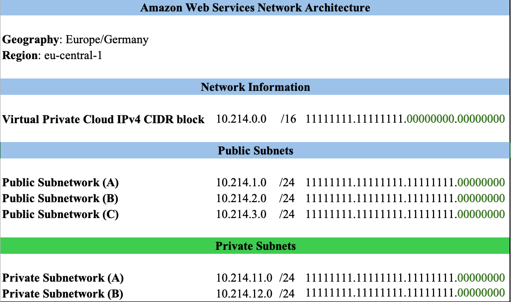
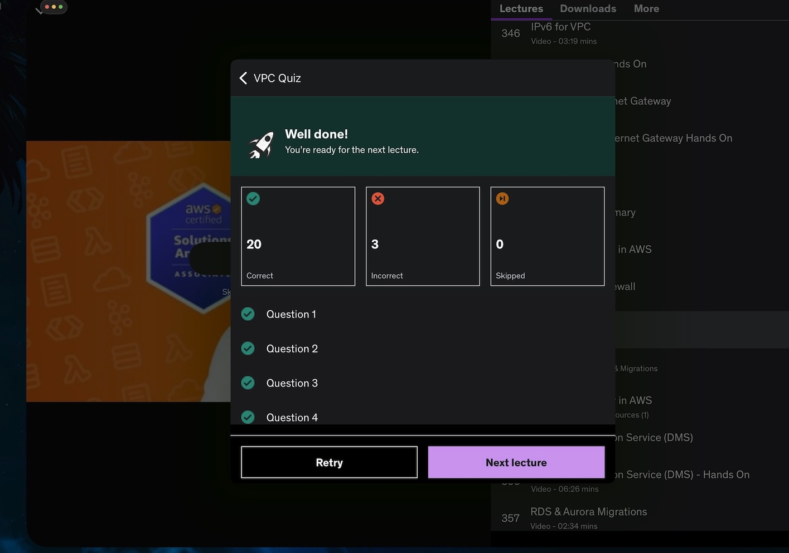
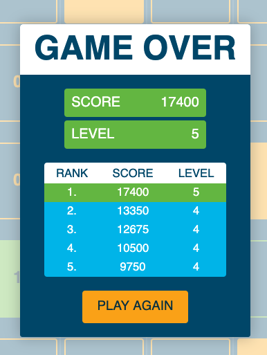

# Week 4 Homework Deliverables

## Amazon Web Service (AWS) Network Architecture 

This network contains 3 public subnets and 6 private subnets.

Documentation: Details are in file [Network Architecture](class07-hw04-aws-network.xlsx)

***

## Amazon Web Service (AWS) VPC Network 

This network contains 3 public subnets and 2 private subnets.

***

##  Udemy Quiz Results

***

## Cisco Binary High Score

Need to practice more. This score is *UNSAT*.

