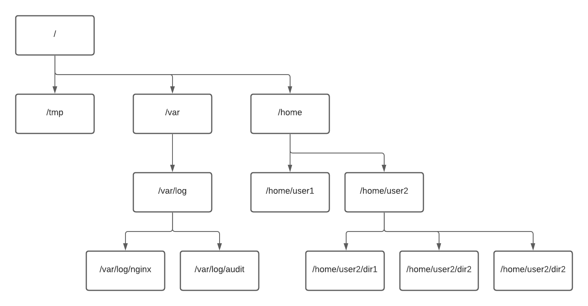

<a id="top"></a>

<details>
    <summary>📑 Table of Contents</summary>

- [Sorting](#sorting)
    - [Sort Content by Size](#sort-content-by-size)
    - [Different Formats](#different-formats)
    - [A Few Arguments More](#a-few-arguments-more)
    - [Test your knowledge](#test-your-knowledge)
- [MAN Basics](#man-basics)
    - [Exploring MAN](#exploring-man)
    - [Another Helping Arguments](#another-helping-arguments)
- [Create Directories](#create-directories)
- [Section 9](#faq)
- [Section 10](#faq)

</details>


## Sorting
Obviously, all lists can be sorted. There is no exception here.

Linux allows us to list files using multiple sorting options. ls command has some options built-in. First type of sort we already observed. By default ls sorts the files alphabetically. Let's try something else.

Before we start, though, there is one concept we need to go through. Linux has differente timestamps, three, to be exact.

atime - the last time when file was accessed
mtime - last modification time. By modification we mean change in the file content.
ctime - last metadata modification time. We mean here - permissions change, location of the file, etc.
It is imperative for you to understand it.

What is timestamp?

This is the numerical representation of the time. It is the number of seconds passed from Unix epoch which is midnight of 1st of January, 1970.

Example how it looks is visible below

```bash
$ date +%s
```
> 1635797690

```bash
$ date
```
> Mon 01 Nov 2021 08:14:52 PM UTC

- Well, on the occasion we learned a new command - date. Enough to say, this command shows the current date and time:

```bash
date .
```
- The first sort option will be -t. This argument sorts files with the last modification time, newest files come first.

Let's try.

```bash
ls -lt
```

- We use two arguments, to observe things better. We can specify exactly the modification time by adding u to the argument list. But please remember, in order to print this information properly you have to use t with another argument (u in this case).

```bash
ls -ltu
```

- Ok, now let's print the list and order it by ctime - metadata change.

```bash
ls -ltc
```

- Well, not much changed, right? Please execute these commands and carefully observe the output

```bash
touch theNewestFile # (this creates a new file)
ls -ltu
ls -ltc
echo "hello world!" > file-02 # (this will add something to the file)
ls -ltu
ls -ltc
chmod 444 file-01 # (this will change the permissions of the file)
ls -ltu
ls -ltc
```

## Sort Content by Size
OK, we know how to sort files by time, let's learn how to do it by size.

As usual, we have multiple options to do so.

First, we run this command

```bash
ls -s
```

- This shows the short list of files and allocated space. As we already know, we can combine this argument - s - with others. Let's do it.

```bash
ls -ls
```

But this is what you have by default, using ls -l, right? No? You are correct, the answer is no. Take a look on the beginning of each line, this is where you can find, what was added by -s.

Why we used s? I wanted you to pay attention here. When capital S is used, this means sort.

```bash
ls -lS it sorts files by size, largest are going first.
```

So, arguments are case-sensitive, like... everything in Linux :)

Before we use the next command, there is one argument more to be learned. This argument is --human-readable, or better - -h

Let's try.

```bash
ls -lh # we have printed the size of the files not in bytes, but in more readable form, with K, M, or G, that sort of things.
```

- h use the powers of 1024. So, 1K is a 1 powered by 1024. We have another otion

```bash
ls -l --si
```

- which uses powers of 1000. But.. I think no one uses that :)

Ok, let's try to sort with h parameter

```bash
ls -lSh
```

[🔝 Back to Top](#top)


## Different Formats
Ok, we are able to sort the list. Now it is time to format it a little.

The first option will be applied to simple ls.

Let's recall, how the simple ls looks like. Now, let's use it with our new argument.

ls -1

Now, please think, why it is obvious thet we do not need to use -1 with -l argument?

--format can be usable when scripting and ls is used for input for other parts of the script.

ls --format=commas will print the files separated by commas. We can use shorter syntax and write

ls -m

Surprise! -l is also the --format option. If you wish to use it in full, use ls --format=long
ls -lQ prints the filenames in quotes

--time-style changes the way how the date is formated in long format. Let's experiment:

ls -l
ls -l --time-style=locale
ls -l --time-style=iso
ls -l --time-style=full-iso

[🔝 Back to Top](#top)

## A Few Arguments More
To finalize some usefull arguments, please take a look on these:

ls -al --author prints the username of the creator of the file.

ls -ald prints directories only. Very useful in some circumstances.

ls -ali prints inodes (there will be a lesson about inodes).

ls -alR recursively prints all subdirectories.

ls -alr prints list in the reversed order. So,

ls -alSr is printing... what? :)

Finale
Two last commands in this scenario.

ls --version prints the version of the binary.

All commands which we used here are available in help. How to get the help?

ls --help

[🔝 Back to Top](#top)

## Test your knowledge
> Q1: What is the whole command to show long formatted list of the files in directory?

<details>
<summary>Answer</summary>

```bash
ls -l
```

</details>

> Q2: The argument for sort files?

<details>
<summary>Answer</summary>

```bash
S
```

</details>

> Q3: I want to pass color argument. What do I need to use?

| Command | How to Use Color                     |
| ------- | ------------------------------------ |
| `ls`    | `ls --color=auto`                    |
| `grep`  | `grep --color=always 'pattern' file` |
| `diff`  | `diff --color=auto file1 file2`      |

<details>
<summary>Answer</summary>

```bash
ls --color=auto
```

</details>

> Q4: UID represents

| UID representation?           |
|------------------------------ |
| `Process identifier`          |
|`User identifier`              |
|`Group identifier`             |
|`Internal system identifier`   |

<details>
<summary>Answer</summary>

```bash
User identifier
```

</details>

> Q5: I want to list the parent directory files. What I need to add to my ls command?

<details>
<summary>Answer</summary>

```bash
`..`
```

</details>

> Q6: I have my ls -lt command. What argument I need to add in order to see the list ordered by modification of the content of the files?

<details>
<summary>Answer</summary>

```bash
u
```

</details>


> Q7: Provide the full command for long format and human readable size.

<details>
<summary>Answer</summary>

```bash
ls -lh
```

</details>

> Q8: Provide the full command (not -m) for short list with commas

<details>
<summary>Answer</summary>

```bash
ls --format=commas
```

</details>


> Q9: List files in short format, one file per line, with quotes.

<details>
<summary>Answer</summary>

```bash
ls -1Q
```

</details>

[🔝 Back to Top](#top)

## MAN Basics
Let's start with simple

man command. Well, it gives us a hint. Let's use it.

Please, execute the

```bash
man man command.
```

Now we can spend at least 10 minutes reading what man command is, all the arguments, options, possibilities.

Try to navigate through the document with arrows. When finished, press

q to quit.

Ok, now let's use the knowledge and learn more about ls.

```bash
man ls
```

[🔝 Back to Top](#top)

## Exploring MAN
Now, we know how to access man, but it is only the first page.

We have a possibility to navigate through pages (or sections). But what sections do we have available?

       1   Executable programs or shell commands
       2   System calls (functions provided by the kernel)
       3   Library calls (functions within program libraries)
       4   Special files (usually found in /dev)
       5   File formats and conventions eg /etc/passwd
       6   Games
       7   Miscellaneous  (including  macro  packages  and  conventions), e.g.
           man(7), groff(7)
       8   System administration commands (usually only for root)
       9   Kernel routines [Non standard]
Ok, let's try to get system administration commands for ls command.

```bash
man 8 ls
```

Well, there is no page 8 for ls. How to check, what sections/pages we have available?

```bash
man -f ls
```

Ok, now we see, ls has 1 page only.

Ok, let's use another command. This time it will be intro. This command in the introduction to Linux commands.

```bash
man -f intro # shows us multiple sections available.
```

Let's play with them, and please remember, if you wish to quit, press q .

```bash
man intro
man 1 intro
man 8 intro
```

[🔝 Back to Top](#top)

## Another Helping Arguments
We have an option to quicly check what command do.

whatis ls shows short description of the functionality.

The same is available with man:

man -f ls

man -k ls searches for the given command through all man pages, and returns all of them as output.

man -w ls returns the location of the file from where the page is rendered.

[🔝 Back to Top](#top)

## Create Directories
First, let's check what we have in our current directory.

ls -l

In order to create directory we need to use mkdir command.

Ok, let's create some structure.

mkdir myfirstdirectory creates directory with provided name.

Now imagine, we want to create multiple directories with similar names. We can create directories using one command after another, and repeat it multiple times. But we have better ways.

Let's create 10 directories, starting with testdir1 to testdir10. How to do it in one command?

mkdir testdir{1..10}

With this syntax we are able to create 10 directories with the name contains numbers from 1 to 10. Very handy.

ls -l

ok, another approach.

mkdir mydirectory anotherdirectory thirddirectory

This creates three different directories for us.

ls -l

Ok, let's create more complicated stuff. In order to create deeper structure, we have to use -p argument. This allows us to create the whole structure, without creating parent directory as first step.

mkdir -p parentdir/childdir{01..100}

What we do here? with -p we allowed the system to create parent directory and the second part we already know. Under the parentdir we created 100 files, from childdir001 to childdir100. Please notice, how nice it is formatted by the system! We said 01, but system created directories to keet three digits as it is in childdir100. Nice.

Let's see what we finally have.

ls -l

And as we created the structure, what we have in parentdir? How to check it? We'll learn more about it in the next section, but for now, let's take a look into parentdir

ls -l parentdir

In this way we can list files in another directory.

[🔝 Back to Top](#top)

## Navigate through the system
We already know what is inside the parentdir. Let's get there now. In order to change the directory, we need to use cd command. As you can expect, it is Change Directory in short.

cd parentdir

ls

There is another command to be sure where we currently are:

pwd . This command shows your current work directory.

We can come back to the previous directory. We can do it by typing

cd .. .

I hope you remember from the first scenario what .. means. It is the parrent directory of the current one.

Ok, where are we?

pwd

Let's move deeper

cd parentdir/childdir023 .

Where are we now?

pwd

As you can see, we can navigate through many directories, providing them with / as separator.

How it works? It will be explained on the next page.

if we want to go to the home directory (the one from where we started) we can do it in already known way: cd .. and again cd .., but it is not cool.we can combine the .. in the same way like we enter this directory:

cd ../..

pwd Ok, we are back.

[🔝 Back to Top](#top)

## A little of theory
Ok, now it is time for another concept, but before we do that, let's create one more directory

mkdir root

We've created the root directory. now let's move to it

cd root

Please take a look where we are:

pwd

We have this structure: /root/root.

Ok, now let's go back

cd ..

Now, let's do almost the same thing

cd /root

Where are we now?

pwd

What is the difference? Obviously, you noticed the / character. What all of it means?

In Linux filesystems, the root, the "first point" is a root directory. This root directory is represented by /. Everything what is on the top level of the filesystem is in / directory.

Let's take a look at the picture below.



Let's suppose, I am in /home/user2/dir1 directory. If I want to go to /var/log/nginx directory, I can do it in several ways.

cd ../../../var/log/nginx
cd /var/log/nginx
What is the difference? In the second version we are using the absolute path. We are referencing our journey through directories to the main, central point of the system - the root, /. When We place / on the beginning of the path it informs the system about our intention to use absolute path.

In the first example we use relative path. It simply means we are navigating from the current position.

Therefore, if we are in our home directory, which is root... Well, don't be confused. We are logged as root user. root user is the most powerful entity in the whole Linux system and it's home directory is /root. Other users have their home directories under /home. So, when you are in /root directory, it is totally different when you type cd /root than cd root.

[🔝 Back to Top](#top)

## Time to go home!
Wherever we are in the Linux system, we have several ways to back home. Some says, all roads lead to Rome, in Linux it is almost true :)

So, first, if you remember your home directory, use it

cd /var/log
pwd
cd /root
pwd

but this is not funny way of doing it.

There is a built-in variable called $HOME. This variable contains the path to the current user home directory.

cd /var/log
pwd
cd $HOME
pwd

By the way, we can display the value of this variable, using echo $HOME
But $HOME is long. We can use something shorter - ~

cd /var/log
pwd
cd ~
pwd

And finally, the shortest version...

cd /var/log
pwd
cd
pwd

Yes, just cd is enough to come back to home directory.

[🔝 Back to Top](#top)

## Delete directories
Let's move to the home directory. cd

pwd

ls

First, we will remove the the root directory.

rmdir root

Now, let's remove all testdir directories.

rmdir testdir{1..10}

Yes, we can use the same syntax like the one when we created these directories :)

Ok, now let's remove parentdir directory.

rmdir parentdir

Hmm. We cannot. The directory is not empty. Ok, we have a way. Do you remember the -p argument of mkdir?

rmdir -p parentdir

Nope.

We have some directory called maindir, let's look inside

ls maindir

So, we can remove parent directory only when it is empty. This will work then

rmdir -p maindir/childdir

In order to remove the whole parentdir we need to do different command, rm. This command works for files. And as everything in Linux is a file, it should work for directories too.

rm parentdir

but... it is not.

Ok, let's... do this

rmdir parentdir/*
rmdir parentdir

Hmm... If you feel it is not like the smart Linux should operate...

You're right.

we have anotherparentdir with the same structure. Let's make it right. And risky.

rm -rf anotherparentdir

Wow, that was it! But.. It didn't work wit rm earlier.

Now we used some arguments

-r means go recursively through directories (and treat everything as file)
-f - force. Another words, do not ask, assume the user knows what he is doing.
And that is why this is risky command.

Try

rm -rf /

and read the notification. Nowadays Linux try to be careful with its users and this command, do you understand why?

[🔝 Back to Top](#top)

## Check your knowledge
Q1: How to check the current directory?

Answer
pwd


Q2: I am in /home/user1. I want to go to /home/user2 using absolute path. How should I do it?

Answer
cd /home/user2


Q3: what ~ means?

root directory
home directory
temp directory
previous directory
Answer
Option 2


Q5: I want to navigate to my home directory. Select all proper options

cd HOME
cd
cd /home/mydir
cd $HOME
cd ~
Answer
Options2, 4 and 5


Q6: I want to navigate to my home directory, using $HOME, and further to app/tests directory:

Answer
cd $HOME/app/tests


Q7: I want to create 100 directories named hello001 to hello100. What is the command?

Answer
mkdir hello{001..100}


Q8: To remove all directories from /directory I have to run (do not use rm command):

Answer
rmdir /directory/*


Q9: How to remove everything without confirmation from /mydir/somedir? Consider you are in /mydir and somedir must be removed as well (do not use absolute path).

Answer
rm -rf somedir

[🔝 Back to Top](#top)

## Create file(s)
In order to create empty file in Linux, we have to use touch command. Let's do it.

touch testfile

Do we have it?

ls -l testfile

Yes, the file exists. We also can see that the file has 0 size, another words, it is empty.

Of course, like in previous scenario, we can create multiple files.

touch my{01..100}file

Let's use the wildcard character * to list all of them

ls my*file

It is not what we really can use here, but if * means any string, sometimes we need to list specific subgroup. Let's prepare ourselves first.

touch try1 try2 try01

Ok, now, we want to list try1 and try2 only. If I use

ls try*

we will receive all three files.

Instead of * we can use ?. This sign means any single character.

Let's try

ls try?

Yep, this is it.

Let's now create some structure.

mkdir testdir
touch testdir/mytest{01..1000} testdir/file{01..1000}

Do you know what we've done?

[🔝 Back to Top](#top)

## Delete file(s)
We already know the proper command. It is rm.

We can remove single file

rm try01

We can remove more than one file

rm try1 try2

We obviously can remove multiple files

rm testdir/mytest{01..1000}

And, yes, we can remove all files, directories, the whole structure

rm -rf testdir

What -rf means? It is explained in previous lesson.

[🔝 Back to Top](#top)

## Vim
Ok, vim is not part of this lesson. But I'd like to make sure, that we understand that touch is not only one way to create files.

Let's run

vim mynewfile

We opened a vim editor. We wil lhave lessone about it later, now it is enough to follow the instruction.

In order to start typing anything in editor (enter insert mode), hit

i .

Put some text, for example

this is my great line

Now, hit ESC key to enter the command mode, and type :wq

You left vim and now you can check the file

ls -l mynewfile

Yes, we have the file and it is not empty!

[🔝 Back to Top](#top)

## The pipes and redirections concept
The concepts is simple, really. The pipes and redirections are used to send (or retrieve) some information sent from one command or script to another command or script. It works on files too. Let's think about some examples:

Count number of lines in the file
Select uniq values from one file and write it in another
Find occurences of some string in the file or system
and many more
Before we start, here are some commands which we will use when learning pipes. Obviously, all these commands can be used independently.

grep. This command search for given pattern in the output. Output may be the file or output from other command.

grep 'case' .bashrc This command will search for pattern case in a file .bashrc.

wc is a utility for counting words, newlines, bytes. Commonly we use it for counting lines.

When we execute

wc -l .bashrc

it will count how many lines (-l argument) are in our .bashrc file.

sort will sort the output in alphabetical order

sort numbers.txt will sort the prepared file with generated numbers.

By using uniq we can limit the occurences of the same record to only one. But in order to have this done properly, sort is needed, therefore, we need to pipe these one to another.

Ok, we learned some new commands, lets use the in pipe.

The pipe |
Our first structure here is pipe, which uses |.

The structure looks lie this:

command1 | command2

command1 | command2 | command3

Yes, we can combine as many pipes as we wish.

How it works? The output of command1 is taken over as input to command2. And this process can continue to the next command.

Ok. Lets print the file first.

cat numbers.txt

Ok, the file is quite huge. How many records we have? Let's pipe the output from the command we just used to wc!

cat numbers.txt | wc -l

We have the number of lines in the file! Perfect. Now, let's collect the information how many unique records we have. I believe, you already noticed that this file contains numbers from 1 to 100. And as we have 10000 records... some must occured many times.

cat numbers.txt | uniq |wc -l

Hm... something is not right. Let's think...

Did we piped our data correctly? At this moment, we can say - yes. We printed the file, select unique values and count them. But... Did we, really?

Did we missed something? Yes, we did. In this case we have here, we used uniq on unsorted data. That is why we have close to 9000 values, when we should have max 100 (as the script which generated the file used random values between 1 and 100). It is important to remember, uniq always works best with sort. And sort is first.

Let's try.

cat numbers.txt | sort | uniq | wc -l

Yeah! That works.

[🔝 Back to Top](#top)

## Redirect to file
Now we will look on redirecting output to file.

Normally, all output is going to the screen. Here we have streams concept involved, but this will be explained in another lab. For now, let's assume that all output is going to the screen.

On the screen we have listed the files. Lets do it again:

ls -al

>
Now, let's redirect this to the file:

ls -al > directorylist.txt

What we did here?

ls -al - we know this already
> redirects all output from the left side of the sign, to the file on the right side of the sign
directorylist.txt file where the redirected output will be sent.
Ok, let's see what is in the file.

cat directorylist.txt

File contains exact output of ls -al command.

Ok, let's write more stuff to the file. We have small file, .profile. Lets cat it and add the output to the directorylist.txt file.

cat .profile > directorylist.txt

Now it is time to see the file!

cat directorylist.txt

Hm... wait... We should add content, not rewrite it! What happened?

Well, the > redirection will do as follows:

If file doesn't exist, create it
Add content from redirected output
If file exists and it is not empty, clear the file and write the redirected output in empty file
Now you see what happened? Ok, so how to append and not rewrite the file? Is it possible?

Yes, it is.

>>
We need to use another syntax for redirection: >>.

Let's try this:

rm directorylist.txt - we removed the file, to have clear start.

cat .profile > directorylist.txt - we did the first redirection, and now we will append something from command line and the file with directory listing:

echo 'this line is a separator!' >> directorylist.txt

ls -al >> directorylist.txt

Let's check

cat directorylist.txt

Summary of redirections
You need to remember, that > will create file (if not exists) and rewrite all data as fresh file. >> behaves similarly, however, if there is any content in the fill, this redirection will add theoutput of the command on the end of existing content.

[🔝 Back to Top](#top)

## redirect from the file
We did redirection to the file. We can do it in oposite direction too.

We have our numbers.txt file. When we print it, we see:

cat numbers.txt

Ok, let's use this file as input for our commands.

Do you remember how we couted number of lines in the file?

cat numbers.txt | wc -l this is... not perfect way, believe me. Familiarize yourself with this very old webpage. Yeah, it is written more than 20 years ago in HTML 3.2! How cool is that! (and... it is 3 years younger than my first HTML page ;) )

So, we can just do

wc -l numbers.txt

Ok, works. we have number of lines, but... We have a filename also. Yeah, we can do different things to remove it. Example? Yeah, why not!

wc -l numbers.txt | awk '{print $1}'

or...

awk 'END{print NR}' numbers.txt

(Now you can go outside and impress everyone around what you know about Bash and awk! ;) )

But we want to use redirection to count the lines.

wc -l < numbers.txt

Ok. Let's write this number to another file

wc -l < numbers.txt > count.txt

cat count.txt - we have it!

We can do crazy (and sometimes useless) things

sort < numbers.txt | uniq for example.

The input redirection, <, is used mostly to redirect content to file. To do some operations. Lets see the very simple example of one-liner:

while read line; do echo "Content of the line: ${line}"; done < numbers.txt

What we just did? We created a loop (we will talk about that later) and print every line from the file, as long as there is nothing more in the file numbers.txt.

[🔝 Back to Top](#top)

## Quiz
Q1: The sign | is used for pipe or redirection?

Answer
pipe


Q2: Which example represents the situation, when Command2 operates on output from Command1?

Command2 | Command1
Command1 || Command2
Command1 | Command2
Command1 | Command3 | Command2
Answer
Option 3


Q3: I have a file where each line contains one word. I want to know how many unique words I have in file. What command will do the job?

cat file | sort | wc -l
cat file | sort | wc -l | uniq
cat file | uniq | sort | wc -l
cat file | wc -l | uniq | sort
cat file | sort | uniq | wc -l
Answer
Option 5


Q4: What sign I have to use in order to append the file when redirection is used?

>>
>
>=
<
<<
Answer
Option 1


Q5: the wc -l < numbers.txt command will

count letters in the filename of the file
count number of lines in numbers.txt file
write count into numbers.txt file
Answer
Option 2

[🔝 Back to Top](#top)

## cat and vim
In the current directory we have one "special" file, testfile. This file is a copy of syslog file and contains a lot of information. Enough, to see different ways to read the file.

Let's check if the file is available.

ls -l testfile

First, we will use this opportunity to learn a new command. cat can print all files, but it is not necesairly smart to print binary files with cat. It is usable for text files. So, let's learn if the file really is the text file.

file testfile

cat
The most basic and I think, mostly used command is cat. As usual in linux the name of the file is a kind of contraction of longer word, in this case - concatenate.

Ok, now we can read the file.

cat testfile

Well... Yeah, the file was printed, but the case here is that the file is fully printed. From the start to the end. We will see how to avoid this a little bit later.

vim and view
Let's be honest. The true linux admin uses vim. Or even more, the true admin uses vi :) most modern distributions contains vi, vim (in fact in most cases, vi is replaced by vim), emacs, nano... here are many text editors available.

It is important to understand one thing. cat just prints the file. vi is fully functional, very powerful text editor.

Before we run vim, let's learn new, very important thing. Please, try to guest, what is this?

dwfi4t0gjvg0eg5jqh58wgpoweh4w8ghbo;witheaigh

It is what one does when incidentally opens vi and doesn't have any idea how to quit.

Right, in order to exit vim, press ESC and then :q - what means quit.

If you changed something in the file and you don't want to save the changes, press :q!.

If you want to save these changes, press :wq - write and quit.

By using ESC we switch between modes in vim. One is INSERT mode. In this mode we can edit the file. Second is COMMAND mode, where we can interact with vim and do actions. Like save and quit. Third mode is VISUAL. in this mode we can do selection of text.

In most cases, when we enter vim, it starts in COMMAND mode.

Ok, let's see our file with vim.

vim testfile

We will touch vim in the lab later. Now it is enough to say that you can navigate using arrows (mostly :)). When you want to quit, please press ESC and then :q!

So, this is vim.

We have another possibility to work with vim. We can run it in read only mode:

view testfile

In order to quit, please execute - :q.

[🔝 Back to Top](#top)

## Less and more
It is time to learn two new commands to print file content. We already know cat. The downside of cat is that this command prints the whole file in one shot. It is rather inconvenient to go through large files in this way.

more
The first command which we can use in order to have better experience is more.

more testfile

Now, we are in somehow interactive mode and we are able to navigate through file. However more has it's own limitations. We can go forward only, using enter. In order to quit, press

q

less
There is a more sophisticted tool to read the file. It is called less. This command gives us better navigation. We can go back and forth using the same keys like in vi, moreover, we can search for strings, using / sign.

less testfile

Now, please try to go through the file. Down and upwards.

/Resolution

This searches through the file for Resolution string. Remember, linux is case-sensitive!

By n

and

N we go through search results, down and upwards.

In order to quit, press q

Pipes
What is interesting, we can use cat, more and less together with pipes.

cat testfile | more

cat testfile | less

[🔝 Back to Top](#top)

## Print part of the file
Despite the possibility of printing the whole file and navigate through it, we can print part of the file. We have two possibilities.

head
It we want to print first lines of the file, we can use head. By default head shows 10 lines.

head testfile

If we wish to see different number of lines, we can use -n argument and pass the number for lines.

Let's try with 2 lines

head -n2 testfile

And now for 22 lines:

head -n22 testfile

tail
tail does exactly the same thing as heead does, but from the end of the file.

tail testfile prints 10 last lines.

tail -n2 testfile will print 2 last lines, and

tail -n22 testfile will show 22 lines.

similar like with less and more, both head and tail can be used with pipes.

Let's see on the examples. Please try to understand what you will see before you execute the commands!

cat testfile | tail -n1

cat testfile | head

cat testfile | head -n4 | tail -n2

## Quiz
Q1: Which command shows the whole file?

cat
show
edit
print
Answer
Option 1


Q2: This command allows to navigate and search through the file

more
edit
cat
less
more
Answer
Option 4


Q3: I want to see 5 first lines from the file

cat file
less -N5 file
less --head file
head -n5 file
head -N5 file
Answer
Option 4

[🔝 Back to Top](#top)

## Copy files
First, let's take a look how to copy the file. Copy, means that we copy existing file to the new filename or location. The source file is still available.

In this lab we have some directories structure with files prepared. Let's take a look.

tree sourcedir

We used here a new command, tree. It recursively shows the content of the directory. Recursively means if there is a subdirectory, its content will be shown as well.

cp
The command to copy file is cp. The way how we use it is very simple:

cp source target

Ok, we know the command, let's use it. But first we need to create a directory where we will copy files.

mkdir targetdir

Let's go to our source directory

cd sourcedir

Now we can copy one file to the target directory. From our current location, the targeet is one level higher, so we need to use .. in order to say go to parent directory.

cp one ../targetdir

Ok, do we have the file there?

ls -l ../targetdir/one yes. Do we have the source file still located in the current directory?

ls -l one

Yeah! This works.

Copy and change the filename
Obviously, we can use cp not just for copying files, but also changing the name of the target file.

In the previous examply we copied one file. Let's copy this file again, but in order to have two files in the target directory.

cp one ../targetdir/another-one

Let's check

ls -l ../targetdir

Copy two or more files in one command
So, we know how to copy file. However, do we know how to copy two files, for example?

copy sourcefile1 targetfile1 and then copy sourcefile2 targetfile2? Well, yeah, we can do it this way. For three files too. For 10 files? Yeah, why not. For... ? :)

Ok, do not be hasty, we will come back to it. Right now let's take a look how we can copy two or so files in one shot.

This is what we will do:

cp file1tocopy file2copy file3tocopy targetlocation

So, last parameter describes where to copy all files listed in parameters (but last, ofc).

cp two01 two02 ../targetdir

Ok, do we have these files in targetdir?

ls -l ../targetdir

Yes, we have it.

Copy multiple files
We can copy many files in easy way, using wildcards.

In Linux we have multiple widlcards. We touch here only two.

? this wildcard replaces one character. So, if we wish to copy all files, where the file name start with my and ends with file, but there is something in between, like a, g or6, but it has to be only one character (so something like my3file, but not myFGfile), I can use ?. It will look like this my?file.
* this wildcard replaces all characters with nay length. Considering last example, if we wish to copy my1file and myFGfile, we will use my*file.
If you wish to learn more about wildcards, run man 7 glob (and quit with q). We talk about man in another lab!

Ok, let's try it.

ls -l three*

ls -l three* | wc -l

We have 10 files, right?

cp three0? ../targetdir

ls -l ../targetdir/three*

ls -l ../targetdir/three* | wc -l

We have 9 files. Why? Please, try to find the answer yourself!

Copy directory structure
We copied files so far. Let's try to copy the whole directory structure, not just the file or files.

First we need to go to the parent directory.

cd

and now we can copy the whole structure:

cp -R sourcedir anotherdir

-R argument means recursively. How to understand this, please take look back on top when we discussed tree

ls -l anotherdir

We copied the whole structure.

Now, important thing. Please remember, the target directory must not exist. What will happen if the directory exist? Let's see!

mkdir testdir

Now we have the testdir directory, and we are ready to recursively copy all files from sourcedir. We do it in exactly the same way like previously.

cp -R sourcedir testdir

Recursive copy thought that you wish to copy the whole structure into testdir directory.

ls -l testdir

Here we see that the whole structure is copied under the directory.

ls -l testdir/*

[🔝 Back to Top](#top)

## Move files
Ok, we know ho to copy files. Sometimes however, we want to move the file from one place to another. For this case, we need to use mv command. The usage is quite similar to cp, but... simpler.

Move one file
Let's clear the screen.

clear

Create another directory:

mkdir movedfiles

And finally we are ready to move our first file.

ls -l sourcedir/one
mv sourcedir/one movedfiles
ls -l sourcedir/one
ls -l movedfiles

Done. Obviously, we can move and change the name:

ls -l anotherdir/one
mv anotherdir/one movedfiles/another-one
ls -l anotherdir/one
ls -l movedfiles

Move a few files
Similar like with cp we are able to move a few files to another location. It looks like this:

mv file1 file2 file3 targetlocation

Let's try:

mv sourcedir/two01 sourcedir/two02 movedfiles
ls -l movedfiles

Move directories
And finally, we can move all directories.

mv anotherdir newdir
ls -l anotherdir
ls -l newdir

And it works similarily like cp did when move is perform to existing directory:

mv newdir movedfiles
ls -l newdir
ls -l movedfiles
ls -l movedfiles/newdir

[🔝 Back to Top](#top)

## More possibilities
In order to copy file, or better to say, copy content of the file, we can use redirections.

We have a special file - .profile. Let's use this file to copy the content.

clear
ls -l newfilewithcontent.txt

File is not exist.

cat .profile > newfilewithcontent.txt

ls -l newfilewithcontent.txt

Now we have the new file. Lets see, if the content was copied.

We can do it is simple way:

cat .profile
cat newfilewithcontent.txt

In this way we visually confirmed that files are the same. But what if the file contains 10000 lines? Will we check every single line? Well, no.

We can check if there is any difference between two files. We do it with a new command - diff. This is the way to compare two files.

diff .profile newfilewithcontent.txt

No output means that both files are the same.

There are other methods to copy files. Even to copy and transform the content during the process. But this is the basic tutorial, so we are not touhing them.

[🔝 Back to Top](#top)

## Our first administrative command - top
At this moment we know a lot of commands. We are ready to look on some administrative side of the work with system. We will learn how to take a basic look on it. But don't be fooled, basic doesn't mean this command is very simple. It is not. The data collected is very vast and informative.

top
We talk here about top command. Let's execute it and then we will go through the displayed information line by line.

top

First line
top - 19:38:28 up 2 days, 20:47, 0 users, load average: 0.52, 0.58, 0.59

In the first line we see something similar to the example above. Let's go through it one by one.

top - program name
19:38:28 - current hour, obvious :)
up 2 days, 20:47 - uptime. Another words, the time from last start of the system.
0 users - number of active users. Here we can see similar information, like with command who . Let's try. First, we need to quit the top:

q

and now we can run who command:

who

The main purpose of who is to show who is logged in. We will touch this command in the future labs.

Let's come back to top screen.

top

The last part, the load average, is very important, yet very often misunderstood.

load average: 0.52, 0.58, 0.59

Let's go through it.

We see here three numbers. They are representing the load average for the system in last 1, 5 and 15 minutes. These shows the average number of processes running and waiting for CPU time.

It is crucial to understand, that these values need to be evaluated very closely with the number of CPUs, Cores, Threads. The number 10 means massive overload when your system has 1 core, but is quite ok when your system has 12 cores. We will learn how to see number of cores in top a little bit later. This is the most basic explanation of load average, and please, be sure, you understand it.

This first line is exactly the same like we have in w command. Let's see.

q for exit the top command,

w

This command shows logged users too, but the first line is exactly the same like in top.

Ok, let's come back to our top command.

top

Second line
Tasks: 6 total, 1 running, 5 sleeping, 0 stopped, 0 zombie

Second line shows us information about processes in our system. What every type means?

total - shows all processes in the system
running - currently active processes. It means, these processes are using CPU right now
sleeping - generally - process is waiting for something. It may be I/O operation for example.
stopped - Stopped processes (for example by ctrl+z)
zombie - Very important state to understand. It is a process which had finish his job but still has entry in the process table. In simple way, these processes are waiting for exit(). It may happen, when parent process deteriorated somehow. Sometimes we are able to kill zombie (by killing the parrent), but in may cases it will not work. But it is not a place to talk about it :)
You will notice very shortly, that total doesn't repesent all processes. For example, you will not find idle state here.

Third line
So far so good. Now it is time for the third line.

%Cpu(s): 13.9 us, 9.5 sy, 0.0 ni, 76.3 id, 0.0 wa, 0.4 hi, 0.0 si, 0.0 st

This line shows the CPU(s) utilization, splitted to specific types. Let's go through them one by one.

us - user - All user processes are combined in this number. So, our sessions too.
sy - system - processes owned by system (kernel)
ni - nice - this is important to understand. nice allows us to change the priority of the process. The standard value for processes is 0 , but we can modify it from 19 (lowest) to -20 (highest) priority. This statistic here shows all processes with the niceness set abow 0. So, the processes which will be executed by the system, when "systemm will have time for it".
id - idle - idle time means that the system is bored and do nothing.
wa - iowait - the number repspresents the time (which is a subset of idle time) when the process is waiting for input/output operation. This statistic is very important, because it may show the issue outside the CPU, in other hardware (but not only) components.
hi - hardware interrupts. These are physical interrrupts from hardware and are handled by CPU itself.
si - software interrupts. These are generated by software and are handled by kernel.
st - steal time - very important to understand, especially when we are working on virtualized environment. This number represents the time "stealed" from the virtual machine by hypervisor. Another words, how long our system needs to wait for resources from hypervisor.
Fourth and fifth lines
MiB Mem :  16217.5 total,   6184.9 free,   9808.7 used,    224.0 buff/cache
MiB Swap:  49152.0 total,  48436.2 free,    715.8 used.   6278.3 avail Mem
We will go through these two lines together, as both represent the memory information. The only one difference is that the first line is about physical memory and second is about swap. We will talk about swap in future lesson.

total, free and used is obvious.

buff/cache is a combine value of buffer memory, used by kernel and cache, memory by page cache.

available simply means that the new starting program, application, etc can use max this size of memory for its to be run.

Processes list
Below these five lines we have processes list. This list contains fields, so let's go through them to better understand the meaning.

PID - Process ID number. It is unique number of the process in the system.
USER - process' owner. The process is started by this user.
PR - default priority of the process, scheduled by kernel when process was started.
NI - nice. Shows the value, if nice was performed against the process.
VIRT - total amount of memory used by the process.
RES - RAM memory used by process.
SHR - amount of memory shared with other processes.
S - process state (we discussed it above).
%CPU - what amount of available CPU is used by the process.
%MEM - like for CPU, but this value represents memory usage.
TIME+ - total time of CPU usage by the process.
COMMAND - quite obvious, this process is executed.

[🔝 Back to Top](#top)

## How to modify the default view
top is a very powerful tool. The main functionality we already know, but it is not all. First, we can modify a lot of visual aspects. Let's do it!

CPU and memory list
Hit 1

And again 1

And again 1 .

What we see here? The CPU information in line 3 is expanded to single cores. We switch here between the unified view and detailed view.

With Killercoda's default setting we probably see only one core. Please, be observant, and notice the difference between Cpu(s) and Cpu0.
Press t couple of times and then

m , also couple of times. Observe, how the CPU or memory visualisation is changing.

Modify the order in the processes list
Now it is time to modify what we see in processes list. Be sure that you have top running.`

The standard view is by CPU usage.

Let's switch to order by memory usage. In order to do it, press

M .

Now, by pressing

N we will look on the list sorted by PID.

Ok, Let's press

T and now we have order by running time.

Finally we can come back to CPU usage sort, by pressing

P

Tasks and threads
By default our processes list contains the tasks. We can switch it to threads by pressing H (and come back to processes by pressing the same key).

Paths and trees
By pressing c we can change between simple name of the command and the full path.

This might be useful with v and V. Please combine them (v, V and H) and play a little. v and V shows the tree of processes, instead simple list. This might help to understand the parent / child relations between processes.

Filtering
Press

n

in order to limit the number of shown processes / threads. When 0 is provided, it means simply all processes.

The prompt for our action appears just above the process list.

We can confirm our selection, by pressing enter or reject it, by using ESC.

When

u

is used, we can select one user to list his processes.

With

o

or

O

we can search through processes. o is case-insensitive and O is case-sensitive.

Refresh
With s we can change the refresh rate. The default is 3 seconds. We may set the refresh as slower or faster.

Kill the process
We didn't talk about it, yet. For now, it is enough to say, we can kill the process using top. In order to do so, press k and provide the PID of the process to kill.

Save the changes
Now interesting thing. If many settings were changed and we wish to keep them for longer time, we don't need to provide all of them again when we use top again. Simply press

W

and the settings will be written in the toprc file in the home directory (sometimes the file can be just .toprc in your home).

Let's see this file.

cat .config/procps/toprc

And now run the top again.

We touched here very limited number of options. There is much, much more to explore. Feel free to go through manual and try by yourself. To learn more, you can read manual

man top

[🔝 Back to Top](#top)

## Start with non default settings
Many of options we used before can be executed directly from the command line. Here are the examples:

top -o %MEM - run top with processes sorted by memory.

q for exit

top -c will show the full paths.

q for exit, again.

And the last example:

top -u root will show the processes owned by root user.

[🔝 Back to Top](#top)

## First look on the ps command
As almost everything in Linux, ps is an abbreviation of Process status.

The simplest execution is just without any argument

ps

This way we cannot see much. This way we can see these processes, which are related to this specific session only. This means, that we see the session itself (bash in our case), and processes executed at this exact moment by this session (ps in our case) Anyway, we can go through fields now.

PID - quite obvious, this is the process id.
TTY - Terminal associated with the process. Here is a very detailed reading about TTY.
TIME - total time of CPU usage
CMD - the command which is running.
Well, not much, right?

I will say more... These are not all processes associated with this terminal (this, where the ps was executed).

Before wy try more, there is one explanation needed. With ps we can use arguments, quite obvious. But there is a trick. Normally, we use arguments with dash, like ls -l. But ps is different. It accepts argument with and without dash. Try these (and maybe even... try to find the answer what is there:) ):

ps a

ps -a

They are different, correct?

Try ps T

Now we have all processes which has any connection with the current terminal. And also, we see different formatting. Let's ignore that CMD become COMMAND, time changed its granularity. We have new column, STAT. It means state of the process and it is very importnt to understand.

Statuses
This list is copied from manual, which I believe are most important to understand.

D - uninterruptible sleep (usually IO)
I - Idle kernel thread
R - running or runnable (on run queue)
S - interruptible sleep (waiting for an event to complete)
T - stopped by job control signal
t - stopped by debugger during the tracing
X - dead (should never be seen)
Z - defunct ("zombie") process, terminated but not reaped by its parent
Some statuses may have the second letter. Let's list the most important

< - high-priority (not nice to other users)
N - low-priority (nice to other users)
s - is a session leader
l - is multi-threaded
+ - is in the foreground process group
List all processes
To list all processes, use

ps -A

It doesn't give much information, but at least you have all processes listed.

[🔝 Back to Top](#top)

## Most commonly used combinations
Well, this lesson is not going through all arguments and combinations. All is in manual and I am sure you will find your best friend soon. But there are some combinations moslty used when admins run ps command.

ps -ef

Used mostly when someone wants to determine the PID of the process.

ps aux

I think it is the mostly used combination. It shows the most important info, like PID, status and resources usage.

Some admins like to see the hierarchy of processes, therefore they use

ps aux --forest

But in reality, pstree is used by them most often. Let's try

pstree

Personally, I preffer ps aux --forrest from these two. It gives me more details. But to take a quick look on the system and dependencies, pstree might be enough.

Finding useful information
To be honest... most of people use grep with ps. But ps has enhanced filtering. So why we use grep? Because... it is only one command to lear and we already know it! With great filtering comes great number of argument and switches to learn.

Anyway, let's go through some.

ps -f -u syslog

shows all processes run by user syslog.

ps -f -C cron

shows all processes, where the executable is cron.

ps -f -p 1

shows process with specified PID.

ps -f --ppid 1

show all processes, where parent process has PID 1. About parents, children, etc we will talk in future lesson.

With -p we can specify more PIDs with coma. Something like ps -f -p 2543,8843,3456.

There is much, much more options, views, etc. Here we took a look on the base functionality.

more information is in manual man ps

[🔝 Back to Top](#top)

## How to use alias
Aliases give us a great possibility to "shape" command line to our needs. Let's suppose, we want to list all files in long format and with hidden files:

ls -al

We have to use 6 characters. not much. But if we need to repeat this command again and again, it may become tough. So, what about this:

ll

Better?

Definitelly.

ll (and a few more) is an alias configured in our profile configuration (please have in mind, not always, not for all users, not in all systems). Before we see how to do it, let's create some aliases in command line first.

In order to create alias we need to use alias command. This time it is not an abbreviation :). Ok, let's create an alias for ls with long list, hidden files and human-readable format of size.

alias lh='ls -alh'

What we did?

We want to create an alias called lh and when we invoke it, it should execute the ls -alh command.

Now we are redy to execute this alias:

lh

Please remember, this alias is available in this session only. It is not available in other sessions, it will be not available when new session is started.

Ok, are you curious what aliases you have in your system? We have lh now, we know about ll. Is there anything else?

alias shows all defined aliases in the session.

Sometimes we want to remove aliases. Well, honestly, I never needed to do that, only during the trainings :)

anyway, lert's remove the alias created during this lab:

unalias lh

Can we remove alias, if it was defined earlier, somewhere in the configuration? Let's try:

unalias ll

Ok, now we can check the alias

And let's try ll, what we should see?

ll

[🔝 Back to Top](#top)

## Make alias permanent
We have at least two ways of creating aliases "forever".

First, take a look on .bashrc file.

grep "alias " .bashrc

As we can see, there are some entries for aliases. Let's add our previous one to .bashrc. We don't care about the strict location in the file for now. We'll add it on the end.

echo "alias lh='ls -alh'" >> .bashrc

Let's see:

grep "alias " .bashrc

In order to use this alias we need to load .bashrc into our session.

source ./.bashrc

source is very useful in many cases. It reads and executes scripts (or should we say - content of the files, as it doesn't need to be script) in current shell. By default, when we execute a script, it will be executed in its own shell. We will come back to this context soon.

Check the alias:

lh

Another file, where we can add our alias is .bash_aliases. This file should be loaded automatically when .bashrc is loaded.

In order to be sure, we need to check if the proper block is defined in .bashrc:

# Alias definitions.
# You may want to put all your additions into a separate file like
# ~/.bash_aliases, instead of adding them here directly.
# See /usr/share/doc/bash-doc/examples in the bash-doc package.

if [ -f ~/.bash_aliases ]; then
    . ~/.bash_aliases
fi
We can check if we have the file already define, if not we should create it. But with redirections we are able to add something to file (if file exists), or add new file. Let's use it.

echo "alias lh1='ls -alh'" >> .bash_aliases

We can list our file:

cat .bash_aliases

And load it to our current session:

source ./.bashrc

Please, notice that we didn't load the .bash_aliases, but .bashrc. Just a few lines above we have the if statement in order to load additional file.

Let's check our aliases:

alias

And execute the new alias:

lh1

[🔝 Back to Top](#top)

## Aliases for all users
Here we touch the administrative part.

To this point we created aliases for current user. We are able to create aliases for all users. In order to do this, we have to add something to global configuration.

There are couple of ways how to do it, however we will learn the best one.

Here in Killercoda we are logged as root, so nothing additional is needed to do.

The place where we have to add our aliases is /etc/profile.d.

A little theory. When you log in to the system, the ~/.profile file is loaded. But before this file system loads the main and common configuration from /etc/profile file. This file does different things and loads all files from /etc/profile.d directory. Files are loaded in alphabetical order, so one of the good practices is to keep numbers in the files, if the order is important for us. So, let's supose, our aliases are not that important, therefor we can load it on the very end of this execution.

Let's create the file, then, and write another alias.

echo "alias lh2='ls -alh'" >> /etc/profile.d/99-aliases.sh

As you noticed, we saved it as .sh file.

We can add this alias to the /etc/profile file directly, but it is strongly not recommended.

Let's see if it works. First, we will start new session - sudo -i

(we will touch it in one of the next lab) and what we see after the

alias execution?

---