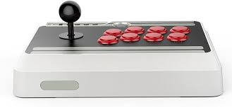

# 💵 My desired income - 350,000.00 euros per year.

## 🧔🏾‍♂️ Group Leader - Brimah_Khalil_Kamara

### My happy place:

> Kribi

---

### My hobby:

> Video Games, Technologies and Knowledge

---

# KillerCoda Screenshot

# 🧭 Basic Command Line Commands 🧭

| Command | Description                                  | Example             |
| ------- | -------------------------------------------- | ------------------- |
| `touch` | Create (add) a new file                      | `touch index.html`  |
| `rm`    | Delete a file                                | `rm oldfile.txt`    |
| `ls`    | List files and folders                       | `ls`                |
| `pwd`   | Show the current (present) working directory | `pwd`               |
| `cd`    | Change directory (folder)                    | `cd Documents`      |
| `mkdir` | Create (make) a new directory (folder)       | `mkdir new_project` |
| `rmdir` | Remove a directory (folder)       | `rmdir new_project` |

---